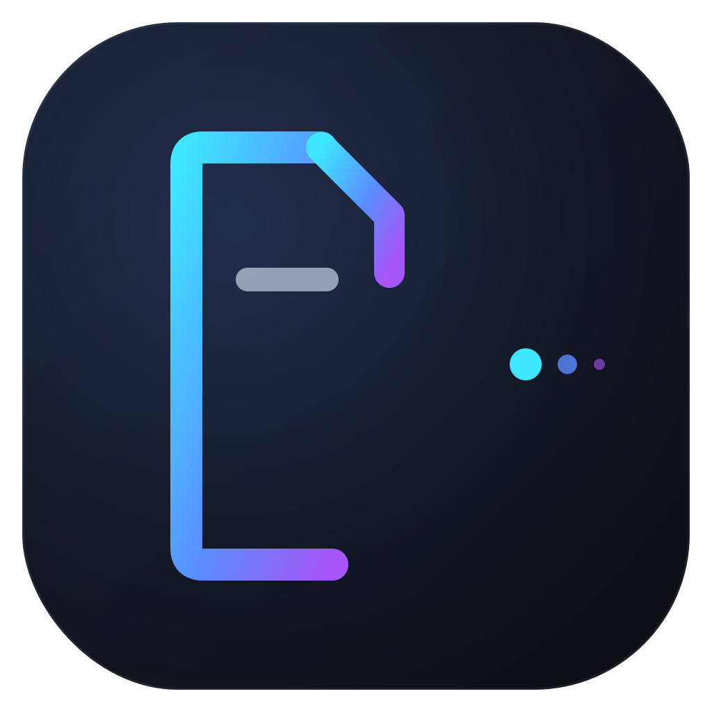
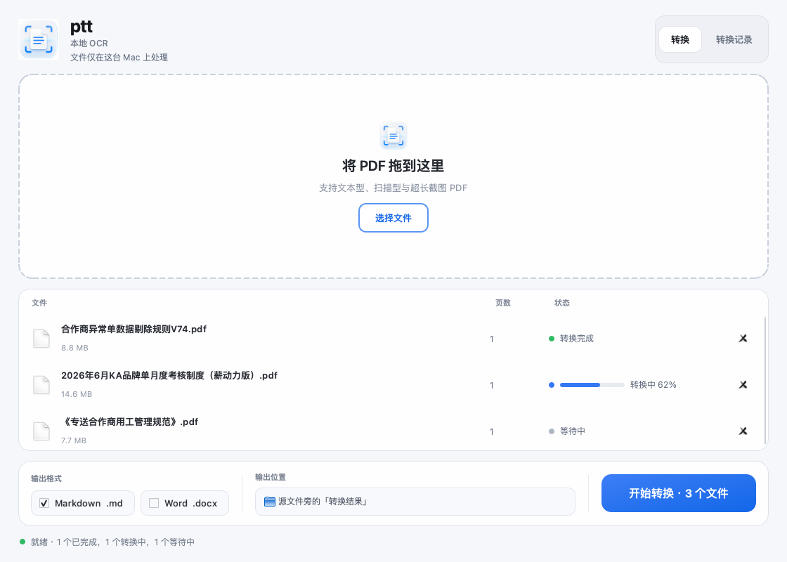

<div align="center">



# ptt — PDF to Text

**Turn any PDF into clean Word & Markdown. 100% on-device.**

English · [简体中文](README.zh-CN.md)

`macOS 12+` · `Apple Silicon / Intel` · `8GB RAM is enough` · `No cloud, no upload`



</div>

---

## Why ptt

Most PDF converters either send your files to a server, or produce a wall of garbled text the moment they meet a scanned page, a watermark, or a table. **ptt** is built on one principle: **accuracy over speed** — and everything runs locally on your Mac using Apple's built-in Vision OCR. Your documents never leave your device.

It was battle-tested on the hardest kind of real-world input: ultra-long screenshot PDFs exported from Feishu/DingTalk (single pages over 65,000 px tall, beyond what most JPEG decoders can even open), full of confidential watermarks, repeated headers, cross-page tables and embedded formulas.

## Features

| | |
|---|---|
| **Text & scanned PDFs** | Native text layer extraction; on-device Chinese/English OCR for scans and ultra-long screenshot PDFs |
| **Watermark removal** | Diagonal / light-colored security watermarks and repeated confidentiality banners are stripped automatically |
| **Header & footer removal** | Doc IDs, page numbers, logos and periodic repeats — including the "virtual pages" inside stitched long screenshots |
| **Table reconstruction** | Simple tables stay as Markdown tables; cross-page, merged-cell, multi-header, and long-description tables are rewritten into readable grouped text |
| **Formulas & diagrams** | Content OCR can't faithfully linearize (fractions, subscripts, flowcharts) is **embedded as pixel-perfect crops** instead of wrong text |
| **Figure text, structured** | Text inside diagrams is re-laid-out by geometry into readable tables — both humans and AI agents can parse it |
| **Self-checking QA loop** | Low-confidence content is re-OCR'd at 2× zoom; headings, formulas, key numbers, and metric names are checked for source-to-output coverage; anything still uncertain is **explicitly flagged** (yellow highlight in Word) |
| **Clean output** | Temp files are deleted automatically — you get just the `.docx` / `.md` (plus the image folder Markdown references) |
| **Agent-friendly** | CLI with JSON output mode: progress on stderr, machine-readable results on stdout |

## Quick start

### GUI

1. Double-click **`启动ptt.command`** (first run installs dependencies once, ~1–2 min online; fully offline afterwards).
   - If macOS blocks it: right-click → Open → Open.
2. Drag PDFs into the window, pick output formats, hit **开始转换**.
3. Results land next to each source file in a `转换结果` folder — or anywhere you choose via **自定义…**.

### CLI / AI agents

```bash
# Basic
.venv/bin/python -m ptt.cli file.pdf -o output_dir -f md docx

# Agent mode: JSON to stdout, progress to stderr
.venv/bin/python -m ptt.cli file.pdf --json
```

The JSON includes `outputs`, `warnings` (what was stripped / auto-corrected), `qa_issues` (locations needing human review) and `flagged_blocks`.

## How it works

```
PDF ──▶ per-page type detection
     ──▶ text layer extraction  /  tiled Vision OCR (1800px strips, overlap dedup)
     ──▶ periodic header/footer & watermark band removal
     ──▶ ruling-based table grid reconstruction (cross-page merge)
     ──▶ diagram / formula region detection → pixel-perfect crops
     ──▶ reading-order assembly (headings · paragraphs · tables · figures)
     ──▶ QA: 2× re-OCR cross-check · frequency-vote typo repair · coverage audit · readability audit
     ──▶ Word (.docx) / Markdown (.md)
```

No ML model downloads, no PyTorch — OCR is Apple's Vision framework, which ships with macOS. That's why the whole repo is ~40 KB.

## Honest limitations

- Dark watermarks burned into scanned images can't always be fully removed (light/text watermarks work well).
- Tiny subscript glyphs (e.g. K₁) are at the edge of Vision's ability — the correct notation is always preserved in the embedded formula image.
- Text inside app-screenshot evidence images is best-effort: treat the embedded image as the source of truth, the text as a search index.
- Anything the tool isn't sure about is flagged, never silently guessed.
