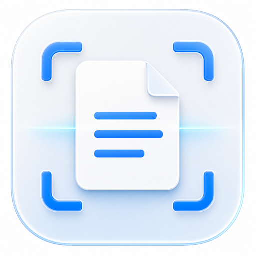

<div align="center">



# ptt — Mac 本地 PDF OCR

**把难处理的 PDF，变成干净、可编辑、可检索的 Markdown 或 Word。**

[English](README.md) · 简体中文

`100% 本地处理` · `无需上传文件` · `Apple Vision OCR` · `支持 Apple Silicon / Intel`


</div>

---

## PDF 可以很复杂，结果不应该是一堆乱码

扫描件、飞书或钉钉导出的超长截图、满页水印、重复页眉页脚、跨页表格、公式和图示——这些内容看起来都像 PDF，但普通“复制文字”或在线转换工具往往无法正确处理。

**ptt 是一款为 Mac 设计的本地 OCR 工具。** 它会先判断每一页应该直接提取文字，还是调用 macOS 自带的 Vision 框架进行中英文 OCR，再按阅读顺序整理内容、重建表格并执行质量检查。

整个过程都在你的 Mac 上完成。合同、财务资料、内部制度和研究文档不需要上传到任何服务器。

## 它最重要的不是“识别”，而是“可信”

很多 OCR 工具会把模糊字符、公式和数字直接猜成一个看似正确的答案。ptt 采用更谨慎的策略：

- 能确定的内容，整理成清晰的标题、段落和表格。
- 低置信内容，放大后再次识别并交叉检查。
- 仍然无法确认的内容，明确标注出来，交给人工复核。
- 不把 OCR 猜测包装成确定事实。

这也是 ptt 的默认原则：**宁可慢一点，也不要静默出错。**

## 适合这些场景

- 把扫描版合同、制度或报告转成可编辑文本。
- 整理飞书、钉钉等系统导出的超长截图 PDF。
- 从带有水印、页码和重复页眉的文件中提取正文。
- 将 PDF 转为 Markdown，交给知识库、搜索系统或 AI Agent 使用。
- 同时生成 Word，方便继续排版、批注和交付。

## 核心能力

| 能力 | ptt 如何处理 |
|---|---|
| **文本型与扫描型 PDF** | 有文字层时直接提取；扫描件使用 macOS Vision 进行本地中英文 OCR |
| **超长截图 PDF** | 对超高页面分片识别并自动去重，避免常规图片解码限制 |
| **水印、页眉与页脚** | 识别跨页重复内容，过滤浅色水印、页码、文档编号和周期性声明 |
| **表格还原** | 简单表格输出为 Markdown 表格；复杂跨页表格整理为更易读的分组结构 |
| **公式与图示** | 无法可靠线性化的区域会标记为需要核对，不强行生成错误公式 |
| **质量检查** | 对低置信内容二次识别，并检查章节、关键数字和指标名的覆盖情况 |
| **干净输出** | 自动清理裁切图和中间文件，默认只保留最终结果 |
| **批量处理** | 图形界面支持一次加入多个 PDF，并显示逐文件状态和进度 |

## 快速开始

### 使用图形界面

1. 双击 [`启动ptt.command`](启动ptt.command)。
2. 首次运行会自动创建环境并安装依赖，需要联网约 1–3 分钟；完成后 OCR 可离线运行。
3. 将一个或多个 PDF 拖入窗口，选择 Markdown 或 Word 输出。
4. 点击 **开始转换**。
5. 结果默认保存在源文件旁的 `转换结果` 文件夹；点击界面中的输出位置可以改为其他文件夹。

如果 macOS 提示无法打开启动文件，请右键点击它，选择 **打开**，然后再次确认。

### 输出格式

- **Markdown (`.md`)**：默认选项，适合知识库、检索、版本管理和 AI 工作流。
- **Word (`.docx`)**：适合继续编辑、批注、排版和办公交付。

## 命令行与 Agent 模式

```bash
# 转换为 Markdown
.venv/bin/python -m ptt.cli 文件.pdf -o 输出目录

# 同时生成 Markdown 和 Word
.venv/bin/python -m ptt.cli 文件.pdf -o 输出目录 -f md docx

# 返回机器可读 JSON；进度信息写入 stderr
.venv/bin/python -m ptt.cli 文件.pdf --json

# 查看版本
.venv/bin/python -m ptt.cli --version
```

JSON 结果包含：

- `outputs`：生成的文件。
- `warnings`：水印、页眉等处理提醒。
- `qa_issues`：建议人工核对的位置。
- `flagged_blocks`：低置信内容块数量。

## 工作流程

```text
PDF
 ├─ 判断页面类型：文字层 / 扫描图像
 ├─ 直接提取文字，或分片执行 Vision OCR
 ├─ 清理重复水印、页眉与页脚
 ├─ 重建表格、图示文字和阅读顺序
 ├─ 对低置信内容放大后重新识别
 ├─ 执行内容覆盖与排版质量检查
 └─ 输出 Markdown，可选 Word
```

ptt 不下载额外 OCR 模型，也不依赖 PyTorch。识别能力来自 macOS 自带的 Vision 框架。

## 运行要求

- macOS 12 或更高版本。
- Apple Silicon 或 Intel Mac。
- 建议至少 8GB 内存。
- 首次安装依赖时需要网络；正常 OCR 转换无需上传文件。

## 能力边界

ptt 会尽力处理复杂文档，但不会承诺不存在的“百分之百准确”：

- 已经烙在扫描图像中的深色水印，可能无法完整清除。
- 极小下标、复杂分式和低分辨率公式处于 OCR 能力边缘。
- 截图内部的超小字号文字可能需要人工对照原 PDF。
- 特殊合并单元格或无明显边界的表格，可能转换为分组文本而不是原始网格。

遇到无法可靠确认的内容时，ptt 会优先提示复核，而不是静默猜测。

## 开发与发布

- 当前版本：[`ptt/__init__.py`](ptt/__init__.py)
- 更新记录：[`CHANGELOG.md`](CHANGELOG.md)
- 发布流程：[`docs/release-process.md`](docs/release-process.md)
- 设计验证：[`design-qa.md`](design-qa.md)

## License

[Apache License 2.0](LICENSE)
